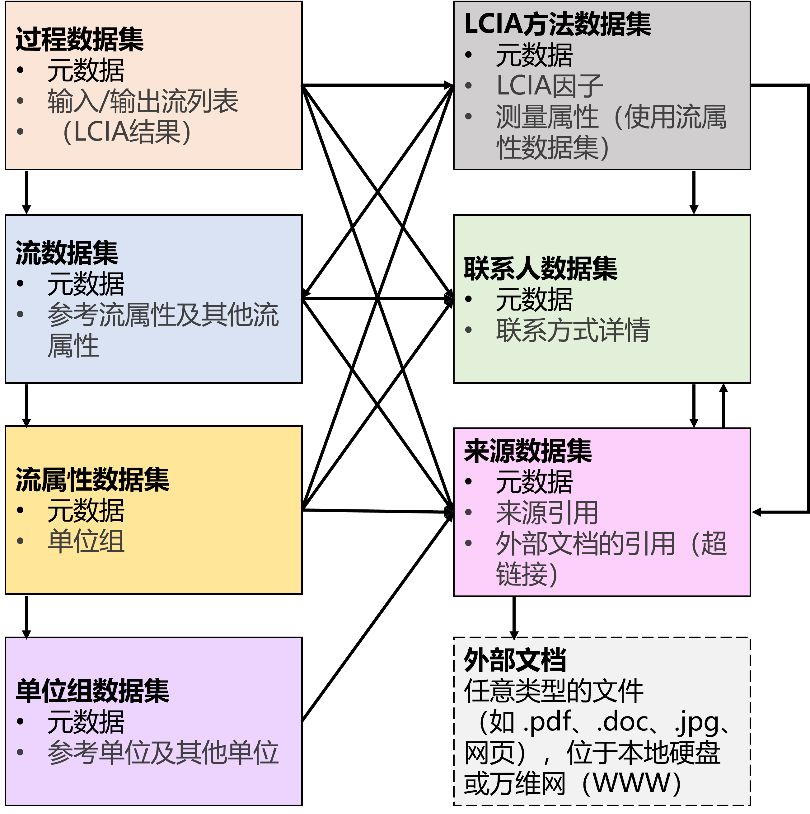

# 1. 概述

## **简介**

本导则包含生命周期评价/碳足迹基础数据（以下称 LCA 数据）的基本概念、数据集构建核心原则、数据集组成等基本信息，以及数据收集、文档记录、数据质量评价等规范要求，形成构建 LCA 数据集的完整导则。

本导则用于指导数据集开发者构建符合高质量、国际通行要求的 LCA 数据集，仅针对 LCA 数据集的相关内容进行解释说明，LCA 基础信息请参考国际标准、国家标准、专业教材等其他指南文件。

本导则中，标记为【必须】的为强制性要求，标记为【建议】的为推荐性要求。

本导则参考国际国内通行方法学标准、数据研制及数据库构建标准、导则和规范等，以保证按本导则构建的数据库符合相关要求。

涉及的标准导则包括但不限于：

- ISO 14040 / 14044 / 14064 / 14067 等国际标准
- GB/T 24040-2008 / 24044-2028 / 43620-2023 / 24067-2024 等国家标准
- 联合国环境署全球生命周期评价数据库指导原则（Global Guidance Principles for Life Cycle Assessment Databases）
- 欧盟国际生命周期数据系统（International Reference Life Cycle Data System， ILCD）系列指南
- 欧盟环境足迹（Environmental Footprint v3.1）合规数据集导则
- ecoinvent、GaBi 等国际主流数据库构建导则

## **数据集构建核心原则**

### **可追溯性**

可追溯性是指确保 LCA 数据集开发中使用的所有来源，包括文献、报告、技术文件和其他文档，都是可访问和可验证的。具体而言，这要求每一项数值和信息都必须能够追溯到其原始来源，即在原始文档中有明确的记录。数据点在原始文件中无法直接找到或被处理过的情况，必须详细记录。可追溯性保证 LCA 数据集及应用该数据集开展的 LCA 工作可以被审核和验证，从而增强其可信度和可靠性。

### **透明性**

透明性是指所有的产品系统和生命周期清单（Life Cycle Inventory，LCI）必须基于单元过程构建、且单元过程的组合和连接方式必须可见。透明性确保生命周期的每一个阶段、每个供需和过程对所有利益相关者可见，以支持对模型的理解、审查、验证和潜在改进。由于目的、边界、工艺特征、数据限制等因素只能以黑箱类型来开发的数据，系统边界必须尽量小并且详细说明原因。

### **完整性**

完整性指 LCA 数据集中的内容必须被最大限度的完整记录，包括目标、范围（边界、假设等）、数据收集过程、建模方法以及数据质量管理（如审查和验证）的详细描述，以确保对数据集及其开发过程的评估、审查和重现。记录完整性保证 LCA 数据集及应用该数据集开展的 LCA 工作可以被完整地理解，尤其有助于开展 LCA 工作间的直接比较。

### **代表性**

代表性是指 LCA 数据集能够在技术、时间、地理等维度代表产品生产或废物处置技术的整体或多数的情况，对于背景数据库尤为重要。评估背景数据集的代表性，可通过分析数据集所代表的某技术（或产品）在一定时间和地理区域内的产量（或处置量）相对于市场总产量（或总处置量）的占比来量化。

### **安全性**

安全性指在开发 LCA 数据集及构建数据库的过程中需保证原始数据来源的数据权属和安全，尤其是用于开发平均数据集和通用数据集、可能包含具体技术、材料使用、能源消耗的实际特定数据集。在当前信息技术发展的情况下，可基于区块链等技术实现数据不出域的隐私计算，保证数据知识产权、避免机密数据泄露。

## **数据集构建流程**

LCA 数据集开发和构建流程如图 1 所示。首先定义数据集构建的目标和数据边界，进而开展单元过程数据收集，并确定系统建模原则和方法；对单元过程数据集进行规范化处理并形成标准格式，基于生命周期模型构建生命周期清单；单元过程数据和生命周期清单均通过数据审查和验证集成进入数据库。具体各步骤的工作和要求，请参考后续章节。

图 1 生命周期数据库构建流程

【建议】采用迭代方法开发 LCI 数据集（如图 2）。
- 在研究开始时尽可能精确地定义目标
- 根据目标定义，在初步了解的范围内推导出初步的范围定义。
- 为前景和背景系统收集容易获取的生命周期单元过程或清单数据。根据初始信息和数据的允许范围建立过程或系统（例如产品）的模型。
- 计算生命周期影响评估（LCIA）结果。
- 识别影响LCIA结果的关键因素，并对初始模型进行敏感性、一致性和完整性检查。
- 基于以上步骤进入下一次迭代：从细化或修订范围开始（在某些情况下甚至需要修订目标），并据此改进生命周期模型等。
- 预计完成生命周期数据集构建需要进行两到四次迭代，这主要取决于质量需求或研究目标的要求、单元过程或产品系统的复杂性、以及数据的可用性和质量。
- 记录初始目标和范围定义的细节、关键LCI和LCIA要素以及敏感性、一致性和完整性检查的初步结果。根据交付物的主要报告要求，将初步核心报告作为基础，在后续的每次迭代中不断补充内容、修订错误、优化结构，直至最终形成完整的报告（包括数据集和/或研究报告）。

【建议】建议在研究开始阶段就明确关键审查者/团队，并在必要或适当时邀请相关利益方参与，尤其是在目标和范围定义阶段。

图 2 LCI 数据集开发的迭代方法（参考系列指南）
