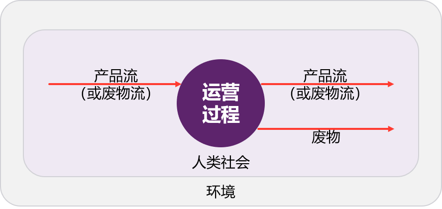

# 第二章 数据集组成

本章节内容主要参考 ILCD、EF 和 ecoinvent 数据库构建导则。其中，[关键组成部分](docs/cifa-guidelines/lca-database-guideline/chapter-2-database.md#关键组成部分)主要参考 ecoinvent 数据库构建导则和 ILCD 生命周期评价数据集文档，并对内容进一步细化。

## 数据包

LCA 数据包组成应规范且完整，以 ZIP 压缩包为形式分发，包括以下两个主要部分：一是数据文件，涵盖LCA数据集所需的核心信息，包括模型、过程、流、流属性、单位组、评价方法、数据来源及联系人等内容；二是技术支持文件，涉及数据库的结构和管理，如数据库信息清单、架构文件和样式表等。

【必须】使用参考数据包，内含所有基本流及流属性等相关信息。

【必须】各类数据的 JSON 文件符合[标准数据结构](docs/cifa-guidelines/lca-database-guideline/chapter-6-appendix.md#数据结构)各项要求。

### 联系人（contacts）

[联系人](docs/cifa-guidelines/lca-database-guideline/chapter-6-appendix.md#联系人数据集)（Contacts）文件，记录数据库内所有相关机构、人员等利益相关方的信息，以 JSON 类型文件存储。

### 流（flows）

[流](docs/cifa-guidelines/lca-database-guideline/chapter-6-appendix.md#流数据集)（Flows）文件，包含基本流、产品流、废物流和其他流的文件，以 JSON 类型文件存储。

### 流属性（flow properties）

[流属性](docs/cifa-guidelines/lca-database-guideline/chapter-6-appendix.md#流属性数据集)（Flow Properties）文件，包含与流相关联的流属性的文件，以 JSON 类型文件存储。

### 生命周期环境影响评价方法（lciamethods）

[生命周期环境影响评价方法](docs/cifa-guidelines/lca-database-guideline/chapter-6-appendix.md#生命周期环境影响评价方法数据集)（LCIA Methods）文件，包含 EF 每个环境影响类别特征因子列表的文件，以 JSON 类型文件存储。

### 过程（processes）

[过程](docs/cifa-guidelines/lca-database-guideline/chapter-6-appendix.md#过程数据集)（Processes）文件，以 JSON 类型文件存储。

### 来源（sources）

[来源](docs/cifa-guidelines/lca-database-guideline/chapter-6-appendix.md#来源数据集)（Sources）文件，以 JSON 类型文件存储。

### 单位组（unitgroups）

[单位组](docs/cifa-guidelines/lca-database-guideline/chapter-6-appendix.md#单位组数据集)（Unit Groups）文件，包含从默认单位到其他单位的换算系数，以 JSON 类型文件存储。

### 生命周期建模（life cycle model）

[生命周期建模](docs/cifa-guidelines/lca-database-guideline/chapter-6-appendix.md#生命周期建模数据集)（life cycle model）文件，以 JSON 类型文件存储。

### 外部文件（external_docs）

所有文件中引用的外部文件，如 PDF 类型的报告文件、JPG 类型的图像文件等。

### 其它（Other）

包含附加文件：验证配置文件、配置文件和软件包转换器等。

### 架构文件（Schemas）

JSON Schema。

## 关键组成部分

针对数据开发者，包含流、过程和 LCIA 方法数据等关键工作对象。

### 流

在 LCA 中，流用来表示环境与系统单元过程之间、系统内单元过程之间交换的物质和能量，分为基本流、产品流和废物流。基本流是单元过程与环境之间的物质和能量交换，如自然资源的消耗和排放物的释放。产品流是单元过程之间传递的主要产品或服务，通常是系统的功能输出。废物流是单元过程中产生的没有经济价值且需要处理或处置的输出物质。

#### 类型

##### 基本流

基本流用来表示取自环境、进入所研究系统之前没有经过人为转化的物质或能量，或是离开所研究系统、进入环境之后，不再进行人为转化的物质或能量。输入基本流用来表示单元过程消耗的自然资源（例如地下的铁矿石、河流中的水或大气中的 O2；输出基本流则表示单元过程释放到土壤、水或空气的排放物。分类请参考[基本流分类](docs/cifa-guidelines/lca-database-guideline/chapter-6-appendix.md#基本流分类)。

【必须】不可自行新建基本流，确实缺少的，应通过专业渠道反馈寻求参考包更新。

##### 产品流

产品流是指单元过程产生的一个或多个具有市场价值的产品，包括物料、商品和服务，可供其他单元过程作为输入使用，进而转化为其他产品、从一个位置转移到另一个位置或进行处理，分类请参考[产品流分类](docs/cifa-guidelines/lca-database-guideline/chapter-6-appendix.md#产品流分类)。（等同于 ecoivent 数据库中的中间流，分类请参考[中间流分类](docs/cifa-guidelines/lca-database-guideline/chapter-6-appendix.md#中间流分类)，用于表示系统内部的物质和能量交换，而非直接与环境之间的交换。）

##### 废物流

废物流是指在产品系统内的单元过程中产生的、没有经济价值且需要处理或处置的输出物质。它通常包括生产过程中产生的废弃物、不可再利用的材料以及需要进一步处理（如焚烧、填埋或回收）的残余物。废物流不直接返回环境，而是通过特定的废物管理过程进行处理。

### 过程

过程是指一个特定的活动或步骤，涉及流的输入、输出和转化；可以进一步分为单元过程（Unit Process，UP）和生命周期清单（Life Cycle Inventory，LCI）；过程数据集根据其在人类活动系统中的功能进行分类。单元过程数据集可以根据技术单元的透明性和拆分性分为“单元过程-单一操作”数据集和“单元过程-黑箱”数据集；生命周期清单数据集可以根据数据的聚合程度分为“LCI 结果”数据集和“部分终止系统”数据集；此外，输出产品或服务的某些特征参数以参数数据集的形式被特定记录。

#### 单元过程（UP）

每个单元过程数据集包含一个单元过程的信息及其与环境和其他过程的交换（图 3）。单元过程的信息包含地理位置、时间段、文档说明、自然资源消耗、能源消耗、物质流和排放配置等信息：

- 地理位置指单元过程可能代表的地理区域，例如中国（CN）；
- 时间段指一个具有开始日期和结束日期的区间，即该技术在此区间内存在；
- 文档说明提供了单元过程代表的内容及其边界等描述；
- 自然资源消耗指生产一单位参考产品所需的自然资源量；
- 能源消耗表示能源和燃料的消耗量；
- 物质流指进入和离开过程的材料，即该过程的物料清单；
- 排放配置包含在生产一单位参考产品时向环境排放的重要物质。

图 3 单元过程示意图

##### 单元过程类型

单元过程数据集包括单一操作和黑箱两个类别，其关系如图 4 所示。无论是单一操作还是黑箱，都可以根据其功能进行详细区分，细化其上游或下游过程的系统性，包含/排除、透明度和内部（隐藏）多功能性，以及建模的完整性。

【必须】单元过程数据集必须是“单元过程-单一操作”和“单元过程-黑箱”两个分类之一。

图 4 单元过程：单一操作和黑箱

###### 单元过程-单一操作

无法进一步细分且仅涉及一个操作或活动的单元过程，涵盖了单一操作的多功能过程。

###### 单元过程-黑箱

过程链或工厂级的单元过程，涵盖了跨不同地点的横向平均单元过程和多个操作或活动的多功能单元过程。不同的副产品在黑箱内经历不同的加工步骤，会导致此数据集存在分配问题。

#### 生命周期清单（LCI）

生命周期清单是指对产品或服务在整个生命周期内所有输入和输出的详细记录，涵盖能源、原材料和其他实物投入，产品和副产品，以及废物、空气/水/土壤排放等。LCI 过程中收集的数据涉及前景系统（过程清单数据由开发者实际一手调查）和背景系统（过程清单数据来自已有数据库或相关文献）。

##### 生命周期清单类型

【必须】生命周期清单数据集必须是“LCI 结果”和“部分终止系统”两个分类之一。

###### LCI 结果

完整或部分产品系统生命周期的聚合数据集，“从摇篮到大门”和“从摇篮到坟墓”，即除了基本流（和可能不相关的废物流和放射性废物）外，输入/输出清单中仅列出该过程的产品作为基准流，而没有其他商品或服务（图 5），也被称为“聚合数据集”。

此类过程涵盖所有将自然资源转化为所需产品或功能（以及多功能数据集所承载的功能与产品）的人类上游活动，是提供详尽的生命周期清单的聚合数据集。如果待处理的废物是唯一的非基本流，那么一定数量的特定废物的生命周期末期处理链/网络（即废物收集、预处理和处理，如回收、能源回收、遗体填埋）就是 LCI 结果数据集。注意，放射性废物流和数量无关的其他废物流都允许留在清单中。

图 5 LCI 结果示意图

###### 部分终止系统

除基准流外，输入/输出清单中至少有一个产品流需要进一步建模的聚合数据集（图 6）。例如，系统中包含一个开放的“电力”输入产品流，则 LCA 专业人员需引入一个专门的电力生产 LCA 数据集来完善数据。值得注意的是，那些尚未将废物管理流程纳入建模的相关聚合过程数据集，亦被视为“部分终止系统”数据集。

“部分终止系统”数据集用于提供基本完整的 LCI 结果数据集，这些数据集要求（并允许）与一个或几个背景数据集进行专门对接，而所有其他上游（和/或下游）过程已预先聚合在内，从而减少建模和审查工作量、提高可复现性并限制对数据集的其他更改。

图 6 部分终止系统示意图

#### 过程分类

##### 按过程性质划分

###### 普通转换过程

所有不属于下文所描述的特殊类型的过程都属于“普通”转换过程。在任一普通转换过程中，输入的资源、材料、能源或产品等在人类活动作用下转化为区别于输入的材料、能源或产品输出（图 7）。例如，在矿山开采硬煤矿并将其加工为在市场上可销售的硬煤产品。

图 7 转换过程示意图

###### 处理过程

废物属于中间流，可以通过处理过程转换成有价值的产品（中间流）或释放到环境中的排放（基本流）。当废物转化为有价值的产品时，处理过程具有较强的回收利用属性，例如对用过的食用油进行净化处理、并作为原材料生产生物燃料。当废物转化为释放到环境中的排放时，处理过程具有较强的最终处置属性，例如处理污染废水以获得无污染的水、然后排到河流中。

与普通转换过程不同，处理过程的参考产品通常位于输入端，处理过程提供处理或处置其参考产品的服务（图 8）。例如，填埋场中惰性废物的处理过程在输入端具有 1 公斤惰性废物的参考产品。

图 8 处理过程示意图

###### 运输过程

运输过程指将对象从一个位置移动一定距离到另一个位置的过程（图 9），例如从供应商处的硬煤到消费者处的硬煤。运输过程需要考虑产品的损耗，例如在运输过程中硬煤的输入量可能会超过其输出量，这是由于运输过程中存在的物质损耗所导致的。

图 9 运输过程示意图

###### 市场过程

市场过程指将一个或多个转化过程输出的产品转移到将其作为输入消费的活动，例如，从供应商处的硬煤到消费者处的硬煤。市场过程的地理边界通常用来反映现实世界的贸易条件。例如，中国硬煤消费者收到的硬煤主要由中国硬煤生产者供应，因此硬煤产品会存在一个地理边界属于中国的市场活动。市场过程包含产品的运输和损失，需要进一步提供给定地区产品的平均消费组合以及归因 LCA 系统模型中的边际消费组合（图 10）。

图 10 市场过程示意图

###### 建设过程

基础设施被定义为具有超过一年寿命且不用于消费的产品，这一定义包括固定基础设施，如建筑物、电力或天然气管网、道路、铁路、矿山和生产设施，以及移动基础设施，如机械、工具和车辆。

生产固定基础设施产品的过程通常被称为建设过程（图 11）。在数据库中，基础设施产品的参考单位通常是“个”，例如 1 个发电厂。建设过程通常涵盖基础设施的初建、使用寿命内的维护、土地占用和土地转型（如适用），以及在使用寿命结束时的退役和废物处理。退役基础设施的废物流以副产品或废物输出的形式离开建设过程。基础设施的质量也随废物流一同离开建设过程。因此，基础设施产品在质量和碳属性方面与众不同。虽然基础设施产品不具备质量属性，但是其具有“使用寿命”和“寿命容量”属性。

图 11 建设过程示意图

###### 服务过程

服务过程包括为另一产品提供服务所需的输入和输出，但这一过程本身不涉及被服务产品的输入和输出（图 12）。因此，服务被定义为非物质交换，即没有实际物品的所有权转移。例如，使用电锯锯木的服务并不涉及将森林中自然生长的树木作为输入。相反，林业过程则明确地将森林中的树木作为输入，同时电锯的工作时长（小时）也被作为其输入，该过程的输出则是砍伐下来的树木。电锯的数量、操作所需的燃料、维护所需的润滑油以及操作过程中释放的排放物都通过服务过程间接进入林业过程。

图 12 服务过程示意图

###### 操作过程

名称中包含“运营/作业/操作”一词的过程表示特定基础设施产品的使用（图 13），例如“矿山作业”与“矿山建设”两者间就形成鲜明的对比（前者属于操作过程，后者不属于），**因此操作数据集总是包含基础设施的输入**。“运营/作业/操作”和“使用”一词同义，不仅适用于工业过程，例如“金精炼操作”，也适用于家庭过程，例如“操作电脑/台式机”。操作过程在满足一定条件下，可以被视为服务过程的一种。操作过程的参考产品并不是任何特殊类型的产品，而只是普通产品，例如通过金精炼操作得到的精炼金。

图 13 操作过程示意图

##### 按行业/产品类型划分

过程按行业或产品性质被分为 7 大类，66 小类，如表 1。

【必须】单元过程和生命周期清单的分类必须基于已有分类体系选择。

表 1 过程分类清单

| **分类 ID** | **分类名称**               |
| ----------- | -------------------------- |
| **1**       | **能源载体和技术**         |
| 1.1         | 能源原材料                 |
| 1.2         | 电力                       |
| 1.3         | 热能和蒸汽                 |
| 1.4         | 机械能                     |
| 1.5         | 硬煤基燃料                   |
| 1.6         | 褐煤基燃料                   |
| 1.7         | 原油基燃料                   |
| 1.8         | 天然气燃料                 |
| 1.9         | 核燃料                     |
| 1.10        | 其他不可再生燃料           |
| 1.11        | 可再生燃料                 |
| **2**       | **材料生产**               |
| 2.1         | 金属和半金属               |
| 2.2         | 有机化学品                 |
| 2.3         | 无机化学品                 |
| 2.4         | 玻璃和陶瓷                 |
| 2.5         | 其他矿物材料               |
| 2.6         | 塑料                       |
| 2.7         | 纸张和纸板                 |
| 2.8         | 水                         |
| 2.9        | 农业生产资料               |
| 2.10        | 食品和可再生原材料         |
| 2.11        | 木材                       |
| 2.12        | 其他材料                   |
| **3**       | **系统**                   |
| 3.1         | 包装                       |
| 3.2         | 电气和电子设备             |
| 3.3         | 车辆                       |
| 3.4         | 其他机械                   |
| 3.5         | 建筑                       |
| 3.6         | 家电                   |
| 3.7         | 纺织品、家具和其他室内用品     |
| 3.8         | 非特定部件                 |
| 3.9         | 涂料和化学制品             |
| 3.10        | 其他系统                   |
| **4**       | **报废处理**               |
| 4.1         | 再利用或进一步使用         |
| 4.2         | 材料回收                   |
| 4.3         | 原材料回收                 |
| 4.4         | 能源回收                   |
| 4.5         | 填埋                   |
| 4.6         | 废物收集                   |
| 4.7         | 废水处理                   |
| 4.8         | 废气处理                   |
| 4.9         | 其他报废服务               |
| **5**       | **运输服务**               |
| 5.1         | 公路                       |
| 5.2         | 铁路                       |
| 5.3         | 水路                       |
| 5.4         | 航空                       |
| 5.5         | 其他运输                   |
| **6**       | **其他服务**               |
| 6.1         | 清洁                       |
| 6.2         | 仓储                       |
| 6.3         | 医疗、社会服务、美容和保健 |
| 6.4         | 修理和维护                 |
| 6.5         | 销售和批发             |
| 6.6         | 通信和信息服务             |
| 6.7         | 金融、法律和保险           |
| 6.8         | 行政和政府                 |
| 6.9         | 国防                       |
| 6.10        | 住宿和餐饮                 |
| 6.11        | 教育                       |
| 6.12        | 研究与开发                 |
| 6.13        | 娱乐                       |
| 6.14        | 租赁                       |
| 6.15        | 工程与咨询                 |
| 6.16        | 其他服务                   |
| **7**       | **使用和消费**             |
| 7.1         | 消费品                   |
| 7.2         | 耗能产品的使用             |
| 7.3         | 其他使用和消费             |

#### 参数数据集

在数据集中，部分或全部交换的数值会根据输出产品或服务的某些特征参数进行相应的缩放调整。建模变量的数学关系应准确表达清单中各类影响参数（技术、管理或其他因素）的变化情况，可以涵盖清单中流之间的定量和定性关系。

### 生命周期环境影响评价（LCIA）方法

生命周期影响评价（Life Cycle Impact Assessment，LCIA）是 LCA 的关键步骤，旨在将 LCI 中的资源消耗和排放清单转化为环境影响指标，以便评估产品或服务在其整个生命周期中的环境负荷。

#### 环境影响中点类别及其指标

环境影响中点类别及其指标如表 2。

【必须】数据库中涉及的环境影响中点类别必须包括所列出的类别。

- **气候变化 (Climate change, CC):** 此指标衡量的是由温室气体 (greenhouse gas, GHG) 排放所导致的全球平均温度上升现象，所有 GHG 排放的全球变暖潜力以二氧化碳当量 (kg CO2 eq) 计量。
- **臭氧消耗 (Ozone depletion, OD):** 平流层中的臭氧层 (O3) 是我们抵御有害紫外线辐射 (UV-B) 的重要屏障，其耗竭增加了人类的皮肤癌病例和对植物的损害。所有相关物质对臭氧层耗竭的潜在影响转换为与三氯氟甲烷 (也称为 Freon-11 和 R-11) 相当的公斤数，因此测量单位为 CFC-11 当量 (kg CFC-11 eq)。
- **人类毒性, 致癌 (Human toxicity cancer, HTOX_c):** 此指标旨在评估环境对人类健康的潜在影响，这类影响源自于人体从空气、水和土壤吸收的有害物质。目前尚未测量产品对人类健康的直接影响，测量单位为相对毒性单位-人类 (CTUh)。
- **人类毒性, 非致癌 (Human toxicity non-cancer, HTOX_nc):** 此指标旨在评估环境对人类健康的潜在影响，这类影响源自于人体从空气、水和土壤吸收的有害物质，测量单位同为相对毒性单位-人类 (CTUh)。
- **颗粒物 (Particulate matter, PM):** 此指标测量由颗粒物 (particle matter, PM) 及其前体物 (例如 NOx, SO2) 排放对人类健康的负面影响。通常，颗粒越小，其危害越大，因为它们可以更深入地进入肺部。其潜在影响以由 PM 排放引起的死亡率变化计量，表达为每 kg PM2.5 排放的疾病发生率。
- **电离辐射 (Ionising radiation, human health, IR):** 暴露于电离辐射 (放射性) 可能对人类健康产生影响。环境足迹仅考虑正常运行条件下的排放 (不考虑核电站事故)。不同电离辐射对人类健康的潜在影响转换为铀 235 (kg U235 eq) 的当量。
- **光化学臭氧生成 (Photochemical ozone formation, human health, POF):** 地面上的臭氧 (O3) 是有害的，它对动植物的有机化合物产生破坏，增加城市中光化学烟雾 (“夏季烟雾”) 存在时的呼吸问题频率。所有促成光化学臭氧生成物质的潜在影响转换为非甲烷挥发性有机化合物 (例如醇类、芳香族等; kg NMVOC eq) 的当量。
- **酸化 (Acidification, AC):** 酸化导致针叶林的衰退和鱼类死亡率的增加，由大气排放和水体及土壤中排放物的沉积引起。电力、热力生产和交通中的燃烧过程是导致酸化的主要因素，燃料中含硫越多，其对加剧酸化现象的作用就越大。促成酸化的物质的潜在影响转换为氢离子 (通用名为原子氢的阳离子形式, mol H+ eq) 的当量。
- **陆地富营养化 (Eutrophication, terrestrial, TEU):** 当含氮 (N) 或磷 (P) 的物质释放到生态系统中时，会发生陆地富营养化。这些营养物质会导致藻类或特定植物的生长，进而抑制原生态系统中其他生物的正常生长。促成陆地富营养化的物质的潜在影响转换为氮的当量 (mol N eq)。
- **淡水富营养化 (Eutrophication, freshwater, FEU):** 当含氮 (N) 或磷 (P) 的物质释放到生态系统中时，会发生淡水富营养化。通常情况下，这些营养物将成为生态系统生长的限制因素，一旦这种营养物增加，藻类或特定植物的生长将会增加。如果藻类过快生长，可能会导致水体中的氧气不足，进而威胁到鱼类的生存。氮的排放主要源自农业活动中化肥的使用，但燃烧过程也是不可忽视的排放源。磷排放的主要来源是城市和工业废水处理厂以及农田的渗漏。促成淡水富营养化物质的潜在影响转换为磷的当量 (kg P eq)。
- **海洋富营养化 (Eutrophication, marine, MEU):** 当含氮 (N) 或磷 (P) 的物质释放到生态系统中时，会发生海洋富营养化。通常情况下，这些营养物将成为生态系统生长的限制因素，一旦这种营养物增加，藻类或特定植物的生长将会增加。如果藻类过快生长，可能会导致水体中的氧气不足，进而威胁到鱼类的生存。在海洋环境中，这主要是由氮的增加导致。氮的排放主要源自农业活动中化肥的使用，但燃烧过程也是不可忽视的排放源。促成海洋富营养化的物质的潜在影响转换为氮的当量 (kg N eq)。
- **淡水生态毒性 (Ecotoxicity, freshwater, ECOTOX):** 此指标指出对生态系统的潜在毒性影响，可能损害单个物种以及生态系统的功能。一些物质倾向于在生物体内积累，测量单位为生态系统的相对毒性单位 (CTUe)。
- **土地使用 (Land use, LU):** 此指标旨在评估用于农业、道路、住房、采矿或其他目的的土地使用和转变。其影响广泛且复杂，可能涉及物种多样性的减少、土壤有机物含量的流失或土壤本身的流失 (侵蚀)。这是一个综合指标，衡量四种土壤属性 (生物生产、侵蚀抵抗力、地下水再生和机械过滤) 的影响，以点数 (Pts) 表示。
- **水资源消耗 (Water use, WU):** 从湖泊、河流或地下水中抽取水资源可能会导致可用水资源的“耗竭”。在评估此类影响时，会考虑活动发生所在区域水资源的可用性或稀缺性 (若相关信息已知)。潜在影响以立方米 (m³) 表示，与当地水资源的稀缺性相关。
- **资源消耗, 化石燃料 (Resource use, fossils, FRD):** 地球蕴藏着有限的不可再生资源, 如煤炭、石油和天然气等化石燃料。这一影响类别的基本思想是，当前对资源的开采将限制未来世代获取相同资源的能力，甚至转向其他资源。例如，化石燃料的枯竭可能导致未来世代无法获得化石燃料。参与化石资源使用的材料量转换为 MJ。
- **资源消耗, 矿物和金属 (Resource use, minerals and metals, MRD):** 这一影响类别的基本思想与化石资源使用影响类别相同 (即当前提取高浓度的资源将迫使未来的世代提取较低浓度或较低价值的资源)。参与资源枯竭的材料量转换为锑的公斤当量 (kg Sb eq)。

表 2 环境影响中点类别、指标、单位及方法描述

| **环境影响中点类别** | **环境影响指标**                                       | **单位**                    | **LCIA 基本方法**                                                                                                                 |
| -------------------- | ------------------------------------------------------ | --------------------------- | --------------------------------------------------------------------------------------------------------------------------------- |
| 气候变化             | 全球变暖潜力辐射强度（GWP100）                         | kg CO2 eq                   | Bern 模型-100 年时间跨度的全球变暖潜力，基于政府间气候变化专门委员会（IPCC）2021 年发布的第六次评估报告（Forster et al., 2021）。 |
| 臭氧消耗             | 臭氧消耗潜力（ODP）                                    | kg CFC-11 eq                | 基于世界气象组织（WMO）臭氧消耗潜值（ODP）模型的 EDIP 模型，以无限时间范围进行评估（WMO 2014 +integrations）。                    |
| 人类毒性、致癌       | 相对毒性单位-人类（CTUh）                              | CTUh                        | 基于 USEtox2.1 模型（Fantke et al. 2017；Rosenbaum et al. 2008），如 Saouter et al.（2018）所述。                                 |
| 人类毒性、非致癌     | 人类毒性比较单位（CTUh）                               | CTUh                        | 基于 USEtox2.1 模型（Fantke et al. 2017；Rosenbaum et al. 2008），如 Saouter et al.（2018）所述。                                 |
| 颗粒物               | 暴露于 PM2.5 的人体健康影响                            | 疾病发病率                  | PM 模型（Fantke et al., 2016 in UNEP 2016）。                                                                                     |
| 电离辐射             | U235 的人体暴露频率（U235）                            | kg U235 eq                    | 由 Dreicer 等（1995 年）开发并由 Frischknecht 等（2000 年）发表的人类健康影响模型。                                               |
| 光化学臭氧生成       | 对流层臭氧浓度增加                                     | kg NMVOC eq                 | ReCiPe 2008 中使用的 LOTOS-EUROS model（Van Zelm et al., 2008）。                                                                 |
| 酸化                 | 累计超标（AE）                                         | mol H+ eq                   | 累计超标（Seppälä et al. 2006, Posch et al., 2008）。                                                                             |
| 陆地富营养化         | 累计超标（AE）                                         | mol N eq                    | 累计超标（Seppälä et al. 2006, Posch et al., 2008）。                                                                             |
| 淡水富营养化         | 进入淡水的营养物质（P）比例                            | kg P eq                     | ReCiPe 2008 中使用的 EUTREND 模型（Struijs et al., 2009）。                                                                       |
| 海洋富营养化         | 进入海水的营养物质（N）比例                            | mol N eq                    | ReCiPe 2008 中使用的 EUTREND 模型（Struijs et al., 2009）。                                                                       |
| 淡水生态毒性         | 生态毒性比较单位（CTUe）                               | CTUe                        | 基于 USEtox2.1 模型（Fantke et al. 2017；Rosenbaum et al. 2008），如 Saouter et al.（2018）所述。                                 |
| 土地利用             | 土壤质量指数                                           | Dimensionless (pt)          | 基于 LANCA 模型（De Laurentiis et al. 2019）和 LANCA CF v2.5（Horn and Maier, 2018）的土壤质量指数。                              |
| 水资源消耗           | 用户缺水潜能（deprivation-weighted water consumption） | m³ world eq. deprived water | 可用剩余水量（AWARE）模型（Boulay et al., 2018; UNEP 2016）。                                                                     |
| 资源消耗，矿物和金属 | 非生物资源枯竭-最终储量（ADP ultimate reserve）        | kg Sb eq                    | CML 2002 v4.8 方法（van Oers et al., 2002）                                                                                       |
| 资源消耗，化石燃料   | 非生物资源枯竭-化石燃料（ADP-fossil）                  | MJ                          | CML 2002 v4.8 方法（van Oers et al., 2002）                                                                                       |
