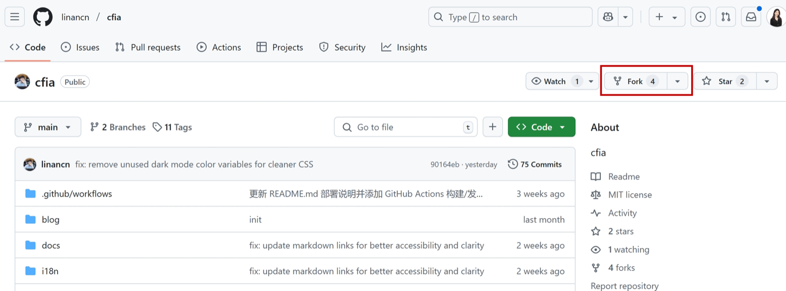
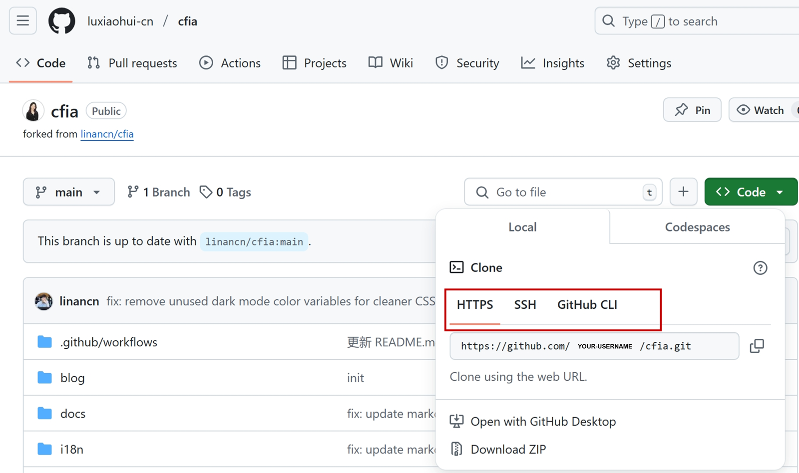

# 联合共创

欢迎为联盟文档做贡献！以下是详细的贡献流程：

## 1. Fork项目

- 访问[CFIA GitHub页面](https://github.com/linancn/cfia)
- 点击右上角的"Fork"按钮
- 选择您的GitHub账户作为目标



## 2. 克隆仓库

```bash
git clone https://github.com/YOUR-USERNAME/cfia.git 
```

您可以根据您的情况选择HTTPS或者SSH。如果您使用SSH，您需要在您的GitHub账户中添加SSH密钥。



## 3. 进行修改

- 文档文件位于`docs/`目录下
- 使用Markdown语法编写文档
- 确保遵循现有文档风格

## 4. 提交更改

```bash
git add .
git commit -m "描述您的修改"
git push origin your-branch-name
```

## 5. 创建Pull Request (PR)

- 访问您fork后的GitHub仓库页面
- 点击"Compare & pull request"按钮
- 填写PR描述，说明您的修改内容和原因
- 点击"Create pull request"

## 6. 代码审查

- 等待项目维护者review您的PR
- 根据反馈进行必要的修改

推荐使用VS Code开发环境

感谢您的贡献！
